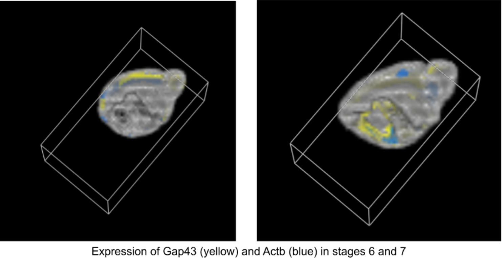

## Visualization course 

For this course we had to implement a volume rendering using Raycasting.
First we used it on an MRI image of an orange and then we apply the raycasting on a real datataset published by the IEEE Scientific Visualization Contest. The dataset provides gene expressions in a mouse brain throughout 7 different stages of development in which region shapes and sizes can change. Regions have been annotated with IDs and there
are 11 different gene categories. 
Practically, we had to implement both **Maximum Intensity Projection(MIP)** and **Compositing raycasting** in order to visualize the volumes.

By using volume rendering, data samples are projected onto the picture plane and this allows us to display more detailed images compared to geometric primitives approaches. 
The main idea with raycasting is, as the name suggests, a ray which is cast and equidistant points are sampled. In order to get a better resolution, the voxel value is obtained by using trilinear interpolation.

To get more information read the *report* in the repo.

I must point out that all the code implemented by me and my colleague is in the **implementation.py** while the other *.py files have been made by the course organizers.

